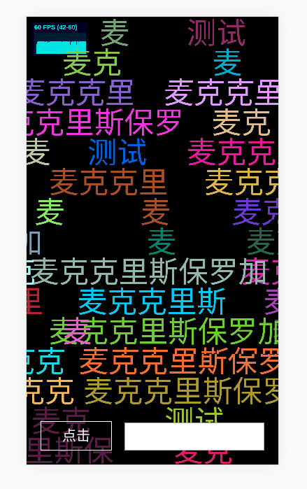

[查看demo](https://leeeeeem.github.io/DanMa/example)

重构代码，复用弹幕对象并且优化代码，性能提升。可以投入生产环境



## 当弹幕列表为空时，停止render，只有当有新的弹幕时重新开始渲染

```
	this._isRunning = false
```

# 实例划分  

### 舞台实例，用于初始化整个舞台，提供整个舞台的相关信息

```
	new Stage()
```

### 弹幕池实例，用于管理整个弹幕列表， doCheck方法用于检测弹幕池

```
	new Pool()
```

### 弹幕实例，用于保存每个弹幕的状态

```
	new Shoot()
```

### 入口实例，对外api为emit方法。 入口用于初始化舞台和弹幕池实例。

```
	new DanMa()

```
